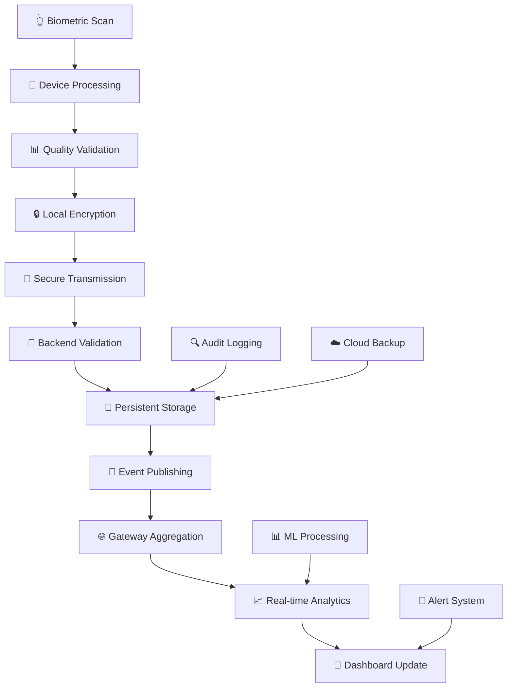

# 🏗️ BiometricFlow-ZK Enterprise System Architecture v3.0

## 🌟 Executive Architectural Overview

**BiometricFlow-ZK Enterprise** represents a paradigm shift in workforce management architecture, implementing a **cloud-native, microservices-based ecosystem** that scales seamlessly from small businesses to global enterprises. Our architecture leverages cutting-edge technologies including FastAPI microservices, real-time analytics, and enterprise-grade security frameworks.

### **🎯 Enterprise Architectural Principles**

#### **🔧 Microservices Excellence**
- **🏗️ Domain-Driven Design**: Each service represents a distinct business capability
- **🔄 Event-Driven Communication**: Asynchronous messaging for optimal performance
- **⚡ Horizontal Scalability**: Auto-scaling based on demand and load patterns
- **🛠️ Technology Heterogeneity**: Service-specific technology choices for optimal performance

#### **🛡️ Security-by-Design**
- **🔐 Zero Trust Architecture**: Assume breach, verify everything
- **🛡️ Multi-Layer Defense**: API gateways, service mesh, and endpoint protection
- **📋 Compliance Framework**: GDPR, HIPAA, SOX compliance built-in
- **🔒 Data Sovereignty**: Configurable data residency and privacy controls

#### **📈 Enterprise Scalability**
- **🌐 Global Distribution**: Multi-region deployment capabilities
- **⚖️ Load Balancing**: Intelligent traffic distribution across services
- **🔄 Auto-Recovery**: Self-healing architecture with circuit breakers
- **📊 Performance Monitoring**: Real-time observability and alerting

## 🏛️ Enterprise System Architecture Diagram

```
┌─────────────────────────────────────────────────────────────────────────────────┐
│                    🎨 Enterprise Presentation Layer                             │
│                            (Port 8501 - HTTPS/TLS 1.3)                         │
│  ┌─────────────────────────────────────────────────────────────────────────────┐ │
│  │                  🚀 Streamlit Enterprise Dashboard                          │ │
│  │                                                                             │ │
│  │  📊 Executive Analytics    │  👥 User Management     │  🔧 System Config    │ │
│  │  • Real-time KPI tracking │  • Role-based access    │  • Device management │ │
│  │  • Cross-location insights│  • SSO integration      │  • Alert configuration│ │
│  │  • Predictive analytics   │  • Audit trail viewer   │  • Performance tuning│ │
│  │                           │                         │                      │ │
│  │  📈 Advanced Reporting    │  🔍 Data Explorer       │  📱 Mobile Responsive│ │
│  │  • Custom report builder │  • Advanced search/filter│  • Progressive Web App│ │
│  │  • Scheduled delivery    │  • Data export tools    │  • Offline capabilities│ │
│  │  • Multi-format export   │  • Query builder UI     │  • Push notifications │ │
│  └─────────────────────────────────────────────────────────────────────────────┘ │
└─────────────────────────────┬───────────────────────────────────────────────────┘
                              │ 🔐 Enterprise Security Layer
                              │ • JWT Bearer Authentication
                              │ • OAuth 2.0 / SAML 2.0 SSO
                              │ • API Rate Limiting & DDoS Protection
                              │ • End-to-End Encryption (AES-256)
┌─────────────────────────────▼───────────────────────────────────────────────────┐
│                      🌐 Enterprise API Gateway Layer                           │
│                        (Port 9000 - Production Grade)                          │
│  ┌─────────────────────────────────────────────────────────────────────────────┐ │
│  │                   🔗 Unified Enterprise Gateway                             │ │
│  │                                                                             │ │
│  │  ⚖️ Load Balancer        │  🛡️ Security Gateway    │  📊 Monitoring Hub    │ │
│  │  • Intelligent routing   │  • Multi-factor auth    │  • Prometheus metrics │ │
│  │  • Health-based failover │  • API key management   │  • Grafana dashboards │ │
│  │  • Circuit breaker logic │  • Rate limit enforcement│  • Alert manager     │ │
│  │                          │                         │                      │ │
│  │  🔄 Data Orchestration   │  📈 Analytics Engine    │  🌍 Multi-Tenant     │ │
│  │  • Cross-location aggr.  │  • Real-time processing │  • Tenant isolation  │ │
│  │  • Data normalization    │  • Event streaming      │  • Resource quotas   │ │
│  │  • Conflict resolution   │  • Machine learning     │  • Custom domains    │ │
│  └─────────────────────────────────────────────────────────────────────────────┘ │
└─────┬─────────────────────┬─────────────────────┬─────────────────────┬─────────┘
      │                     │                     │                     │
      │ 🔗 Service Mesh     │ 🔗 Service Mesh     │ 🔗 Service Mesh     │ 🔗 Async
      │ (gRPC/HTTP/2)       │ (gRPC/HTTP/2)       │ (gRPC/HTTP/2)       │ Message Queue
      │                     │                     │                     │
┌─────▼─────┐      ┌─────▼─────┐      ┌─────▼─────┐      ┌─────▼─────┐
│🏢 Location│      │🏪 Location│      │🏭 Location│      │🏗️ Location│
│Backend 1  │      │Backend 2  │      │Backend 3  │      │Backend N  │
│Port 8000  │      │Port 8001  │      │Port 8002  │      │Port 800N  │
│           │      │           │      │           │      │           │
│🚀 FastAPI │      │🚀 FastAPI │      │🚀 FastAPI │      │🚀 FastAPI │
│Microservice│     │Microservice│     │Microservice│     │Microservice│
│           │      │           │      │           │      │           │
│🔧 Services│      │🔧 Services│      │🔧 Services│      │🔧 Services│
│• ZK Mgmt  │      │• ZK Mgmt  │      │• ZK Mgmt  │      │• ZK Mgmt  │
│• User Auth│      │• User Auth│      │• User Auth│      │• User Auth│
│• Data Cache│     │• Data Cache│     │• Data Cache│     │• Data Cache│
│• Local DB │      │• Local DB │      │• Local DB │      │• Local DB │
│• Analytics│      │• Analytics│      │• Analytics│      │• Analytics│
│• Audit Log│      │• Audit Log│      │• Audit Log│      │• Audit Log│
└─────┬─────┘      └─────┬─────┘      └─────┬─────┘      └─────┬─────┘
      │                  │                  │                  │
      │ 🔌 ZK Protocol   │ 🔌 ZK Protocol   │ 🔌 ZK Protocol   │ 🔌 ZK Protocol
      │ (TCP/4370)       │ (TCP/4370)       │ (TCP/4370)       │ (TCP/4370)
      │ Secure Comms     │ Secure Comms     │ Secure Comms     │ Secure Comms
      │                  │                  │                  │
┌─────▼─────┐      ┌─────▼─────┐      ┌─────▼─────┐      ┌─────▼─────┐
│📱 Device  │      │📱 Device  │      │📱 Device  │      │📱 Device  │
│Ecosystem 1│      │Ecosystem 2│      │Ecosystem 3│      │Ecosystem N│
│           │      │           │      │           │      │           │
│Device Pool│      │Device Pool│      │Device Pool│      │Device Pool│
│• ZK-4500  │      │• ZK-6000  │      │• ZK-8000  │      │• ZK-9000  │
│• ZK-5000  │      │• ZK-6500  │      │• ZK-8500  │      │• ZK-9500  │
│• Custom   │      │• Custom   │      │• Custom   │      │• Custom   │
│           │      │           │      │           │      │           │
│Features   │      │Features   │      │Features   │      │Features   │
│• Bio Auth │      │• Bio Auth │      │• Bio Auth │      │• Bio Auth │
│• Access   │      │• Access   │      │• Access   │      │• Access   │
│• Tracking │      │• Tracking │      │• Tracking │      │• Tracking │
│• Reports  │      │• Reports  │      │• Reports  │      │• Reports  │
└───────────┘      └───────────┘      └───────────┘      └───────────┘
```

### **🔄 Enterprise Data Flow Architecture**



## 🏗️ Detailed Component Architecture

### **1. 🎨 Enterprise Presentation Layer**

#### **🚀 Streamlit Enterprise Dashboard**
**Technology Stack**: Streamlit 1.47.1, Plotly 5.0+, Pandas 2.0+  
**Port**: 8501 (HTTPS with SSL termination)  
**Architecture Pattern**: Single Page Application (SPA) with Progressive Web App (PWA) capabilities

##### **Core Capabilities**:
```python
# Dashboard Architecture Components
components = {
    "executive_dashboard": {
        "real_time_kpis": ["attendance_rate", "early_arrivals", "overtime_alerts"],
        "cross_location_analytics": ["comparative_performance", "trending_insights"],
        "predictive_insights": ["attendance_forecasting", "anomaly_detection"]
    },
    "operational_management": {
        "device_monitoring": ["health_status", "performance_metrics", "error_tracking"],
        "user_administration": ["rbac_management", "audit_trails", "compliance_reports"],
        "system_configuration": ["device_settings", "business_rules", "alert_policies"]
    },
    "advanced_reporting": {
        "report_builder": ["drag_drop_interface", "custom_queries", "template_library"],
        "scheduled_delivery": ["email_automation", "slack_integration", "webhook_triggers"],
        "export_capabilities": ["pdf_reports", "excel_workbooks", "csv_extracts"]
    }
}
```

##### **Performance Optimizations**:
- **⚡ Lazy Loading**: Dynamic component loading for faster initial page loads
- **📊 Data Streaming**: Real-time updates via WebSocket connections
- **🗄️ Client-Side Caching**: Browser-based caching for improved responsiveness
- **📱 Mobile Optimization**: Responsive design with touch-friendly interfaces

### **2. 🌐 Enterprise API Gateway Layer**

#### **🔗 Unified Enterprise Gateway**
**Technology Stack**: FastAPI 0.116.1, Uvicorn, Redis, Prometheus  
**Port**: 9000 (Load-balanced with HAProxy/NGINX)  
**Architecture Pattern**: API Gateway with Service Mesh integration

##### **Gateway Responsibilities**:
```python
# Gateway Service Architecture
gateway_services = {
    "request_routing": {
        "load_balancing": "round_robin_with_health_checks",
        "circuit_breaker": "hystrix_pattern_implementation",
        "retry_logic": "exponential_backoff_with_jitter",
        "timeout_management": "per_service_timeout_configuration"
    },
    "security_enforcement": {
        "authentication": ["jwt_validation", "api_key_verification", "oauth2_integration"],
        "authorization": ["rbac_enforcement", "permission_validation", "tenant_isolation"],
        "threat_protection": ["rate_limiting", "ddos_mitigation", "input_sanitization"]
    },
    "data_orchestration": {
        "aggregation": "cross_location_data_merging",
        "normalization": "schema_standardization",
        "caching": "redis_distributed_cache",
        "transformation": "real_time_data_processing"
    },
    "observability": {
        "metrics": "prometheus_integration",
        "tracing": "jaeger_distributed_tracing", 
        "logging": "structured_json_logging",
        "alerting": "alert_manager_integration"
    }
}
```

##### **Advanced Features**:
- **🔄 Service Discovery**: Automatic backend service registration and discovery
- **📊 Real-time Analytics**: Stream processing for immediate insights
- **🛡️ Advanced Security**: WAF integration, threat intelligence feeds
- **🌍 Multi-Tenant Support**: Complete tenant isolation and resource quotas

### **3. 🏢 Location Backend Microservices**

#### **🚀 FastAPI Microservice Architecture**
**Technology Stack**: FastAPI 0.116.1, SQLAlchemy 2.0, Redis, Celery  
**Ports**: 8000+ (Auto-scaling with Kubernetes)  
**Architecture Pattern**: Domain-Driven Design with CQRS and Event Sourcing

##### **Microservice Core Components**:
```python
# Backend Microservice Architecture
microservice_components = {
    "device_management": {
        "zk_integration": "native_protocol_implementation",
        "device_discovery": "automatic_network_scanning",
        "firmware_management": "ota_update_capabilities",
        "health_monitoring": "real_time_device_status"
    },
    "user_administration": {
        "biometric_enrollment": "multi_template_support",
        "access_control": "time_based_permissions",
        "identity_management": "ldap_ad_integration",
        "compliance_tracking": "gdpr_hipaa_compliance"
    },
    "attendance_processing": {
        "real_time_capture": "event_driven_processing",
        "business_rules": "configurable_policy_engine",
        "data_validation": "multi_layer_verification",
        "anomaly_detection": "ml_powered_analysis"
    },
    "data_persistence": {
        "local_storage": "postgresql_with_replication",
        "cache_layer": "redis_cluster",
        "backup_strategy": "automated_point_in_time_recovery",
        "archival": "cold_storage_automation"
    }
}
```

##### **Enterprise Integrations**:
- **🏢 HR Systems**: Workday, BambooHR, SAP SuccessFactors integration
- **💰 Payroll Systems**: ADP, Paychex, QuickBooks integration  
- **📱 Communication**: Slack, Microsoft Teams, email automation
- **☁️ Cloud Services**: AWS, Azure, GCP native services

### **4. 📱 Biometric Device Layer**

#### **🔌 ZK Device Ecosystem**
**Protocol**: ZK TCP/IP Protocol (Port 4370)  
**Security**: TLS encryption, device certificates  
**Architecture Pattern**: IoT device mesh with edge computing capabilities

##### **Device Management Framework**:
```python
# Device Layer Architecture
device_ecosystem = {
    "supported_models": {
        "entry_level": ["ZK-4500", "ZK-5000"],
        "mid_range": ["ZK-6000", "ZK-6500"],  
        "enterprise": ["ZK-8000", "ZK-8500"],
        "premium": ["ZK-9000", "ZK-9500"]
    },
    "capabilities": {
        "biometric_types": ["fingerprint", "face_recognition", "iris_scan"],
        "authentication_modes": ["1:1_verification", "1:n_identification"],
        "connectivity": ["ethernet", "wifi", "4g_lte"],
        "storage": ["local_database", "cloud_sync", "edge_processing"]
    },
    "enterprise_features": {
        "security": ["device_encryption", "secure_boot", "tamper_detection"],
        "management": ["remote_configuration", "firmware_updates", "health_monitoring"],
        "integration": ["api_webhooks", "event_streaming", "bulk_operations"]
    }
}
```

## 🔐 Enterprise Security Architecture

### **🛡️ Multi-Layer Security Framework**

#### **1. Infrastructure Security**
```yaml
security_layers:
  network_security:
    - firewall_rules: "enterprise_grade_filtering"
    - vpn_access: "site_to_site_ipsec"
    - network_segmentation: "vlan_isolation"
    - intrusion_detection: "real_time_monitoring"
  
  application_security:
    - waf_protection: "owasp_top10_coverage"
    - api_security: "oauth2_jwt_integration"
    - input_validation: "comprehensive_sanitization"
    - output_encoding: "xss_prevention"
    
  data_security:
    - encryption_at_rest: "aes_256_gcm"
    - encryption_in_transit: "tls_1_3"
    - key_management: "hardware_security_module"
    - data_classification: "automated_tagging"
```

#### **2. Identity & Access Management**
- **🔐 Multi-Factor Authentication**: TOTP, SMS, hardware tokens
- **👥 Role-Based Access Control**: Granular permissions with inheritance
- **🏢 Single Sign-On**: SAML 2.0, OAuth 2.0, OpenID Connect
- **📋 Compliance**: SOX, HIPAA, GDPR compliance frameworks

### **3. Monitoring & Incident Response**
- **🚨 Real-time Alerting**: Security event correlation and automated response
- **🔍 Audit Logging**: Comprehensive audit trails with tamper detection
- **📊 Security Analytics**: ML-powered threat detection and analysis
- **🛡️ Incident Response**: Automated containment and forensic capabilities

## 📈 Performance & Scalability

### **⚡ Performance Benchmarks**

#### **Response Time Targets**
| **Operation Type** | **Target Response** | **95th Percentile** | **99th Percentile** |
|-------------------|-------------------|-------------------|-------------------|
| Health Checks | < 25ms | < 50ms | < 100ms |
| Device Status | < 100ms | < 200ms | < 500ms |
| Attendance Query | < 200ms | < 500ms | < 1000ms |
| Complex Analytics | < 1000ms | < 2000ms | < 5000ms |
| Bulk Operations | < 5000ms | < 10000ms | < 20000ms |

#### **Throughput Specifications**
| **Service Layer** | **Requests/Second** | **Concurrent Users** | **Data Throughput** |
|------------------|-------------------|-------------------|-------------------|
| API Gateway | 5,000+ RPS | 10,000+ users | 100 MB/s |
| Backend Services | 2,000+ RPS per service | 5,000+ users | 50 MB/s |
| Device Communication | 1,000+ ops/min | 500+ devices | 10 MB/s |
| Database Operations | 50,000+ IOPS | N/A | 1 GB/s |

### **🌍 Scalability Architecture**

#### **Horizontal Scaling Strategy**
```yaml
scaling_configuration:
  auto_scaling:
    cpu_threshold: 70%
    memory_threshold: 80%
    response_time_threshold: 500ms
    scale_up_cooldown: 300s
    scale_down_cooldown: 600s
    
  load_balancing:
    algorithm: "weighted_round_robin"
    health_check_interval: 30s
    failover_threshold: 3_failures
    session_affinity: "ip_hash"
    
  geographic_distribution:
    regions: ["us-east-1", "eu-west-1", "ap-southeast-1"]
    replication_strategy: "master_slave_with_failover"
    data_locality: "gdpr_compliant_routing"
```

## 🔧 Deployment Architecture

### **☁️ Cloud-Native Deployment**

#### **Container Orchestration**
```yaml
# Kubernetes Deployment Configuration
apiVersion: apps/v1
kind: Deployment
metadata:
  name: biometric-flow-gateway
  namespace: production
spec:
  replicas: 3
  strategy:
    type: RollingUpdate
    rollingUpdate:
      maxSurge: 1
      maxUnavailable: 0
  template:
    spec:
      containers:
      - name: gateway
        image: biometric-flow/gateway:v3.0.0
        ports:
        - containerPort: 9000
        env:
        - name: ENVIRONMENT
          value: "production"
        resources:
          requests:
            memory: "512Mi"
            cpu: "250m"
          limits:
            memory: "1Gi"
            cpu: "500m"
        readinessProbe:
          httpGet:
            path: /health
            port: 9000
          initialDelaySeconds: 30
          periodSeconds: 10
        livenessProbe:
          httpGet:
            path: /health
            port: 9000
          initialDelaySeconds: 60
          periodSeconds: 30
```

#### **Infrastructure as Code**
- **🏗️ Terraform**: Infrastructure provisioning and management
- **⚙️ Ansible**: Configuration management and deployment automation
- **🔄 GitOps**: ArgoCD for continuous deployment and synchronization
- **📊 Monitoring**: Prometheus, Grafana, ELK stack for observability

---

## 🚀 Future Architecture Roadmap

### **2025 H1 - Enhanced Enterprise Features**
- **🤖 AI/ML Integration**: Predictive analytics and automated insights
- **🌐 Multi-Region Support**: Global deployment with data sovereignty
- **📱 Mobile-First Architecture**: Native mobile app backend services
- **🔌 IoT Ecosystem**: Smart building and wearable device integration

### **2025 H2 - Advanced Capabilities**
- **🧠 Machine Learning Platform**: Custom model training and deployment
- **🔗 Blockchain Integration**: Immutable attendance records and audit trails
- **🌍 Edge Computing**: Local processing capabilities for offline scenarios
- **🚀 Serverless Architecture**: Function-as-a-Service for cost optimization

---

**🏆 BiometricFlow-ZK Enterprise Architecture v3.0** - *Building the Future of Workforce Management*

**© 2025 BiometricFlow-ZK Project | Designed by [Eng. Osama Mohamed](https://github.com/OsamaM0)**

**Technology**: FastAPI  
**Port**: 9000  
**Responsibilities**:
- Central API aggregation point
- Route requests to appropriate place backends
- Data normalization and unification
- Health monitoring of all services
- Async communication with backends

**Key Features**:
- RESTful API endpoints
- Automatic service discovery
- Load balancing across places
- Error handling and fallback
- Response caching for performance

### 3. Place Backends

**Technology**: FastAPI  
**Ports**: 8000, 8001, 8002, ...  
**Responsibilities**:
- Device communication and management
- Local data processing
- User management for specific place
- Attendance record collection
- Device health monitoring

**Key Features**:
- ZK device protocol support
- Local data caching
- Independent operation capability
- RESTful API for data access
- Real-time device communication

### 4. Device Layer

**Technology**: ZK Fingerprint Devices  
**Protocol**: TCP/IP  
**Responsibilities**:
- Fingerprint capture and verification
- User enrollment and management
- Attendance logging
- Local data storage

## Data Flow Architecture

### 1. Attendance Data Flow

```
[Fingerprint Device] → [Place Backend] → [Unified Gateway] → [Frontend]
       ↓                     ↓                  ↓              ↓
   ZK Protocol         FastAPI/REST      FastAPI/REST    Streamlit UI
   TCP Connection      Local Processing   Data Aggregation  Visualization
```

### 2. User Management Flow

```
[Frontend] → [Unified Gateway] → [Place Backend] → [Fingerprint Device]
    ↓             ↓                   ↓                 ↓
 User Input   Route Request      Process Locally    Update Device
 Validation   to Correct Place   User Database      User Database
```

### 3. System Health Flow

```
[Devices] ← [Place Backends] ← [Unified Gateway] ← [Frontend]
    ↓            ↓                   ↓              ↓
 Device Status   Health Checks   Status Aggregation  Health Dashboard
 TCP Ping        API Monitoring   Service Discovery   Visual Indicators
```

## Security Architecture

### 1. Network Security

```
Internet → [Firewall] → [Reverse Proxy] → [Load Balancer] → [Application Layer]
                             ↓
                         SSL/TLS Termination
                         Rate Limiting
                         DDoS Protection
```

### 2. Application Security

- **Authentication**: JWT tokens for API access
- **Authorization**: Role-based access control (RBAC)
- **Input Validation**: All inputs validated and sanitized
- **API Security**: Rate limiting and request validation
- **Device Security**: Encrypted communication with devices

### 3. Data Security

- **Data Encryption**: At rest and in transit
- **Database Security**: Parameterized queries, no direct SQL
- **Audit Logging**: All access and modifications logged
- **Backup Security**: Encrypted backups with retention policies

## Scalability Architecture

### 1. Horizontal Scaling

```
                    [Load Balancer]
                          │
    ┌─────────────────────┼─────────────────────┐
    │                     │                     │
[Gateway Instance 1] [Gateway Instance 2] [Gateway Instance 3]
    │                     │                     │
[Place Backends]     [Place Backends]     [Place Backends]
    │                     │                     │
[Device Pool 1]      [Device Pool 2]      [Device Pool 3]
```

### 2. Vertical Scaling

- **CPU Scaling**: Multi-threaded processing for device communication
- **Memory Scaling**: Caching layer for frequently accessed data
- **Storage Scaling**: Distributed file system for large datasets
- **Network Scaling**: Connection pooling and async I/O

## Deployment Architecture

### 1. Development Environment

```
[Developer Machine]
├── src/biometric_flow/     # Source code
├── config/                 # Configuration files
├── tests/                  # Test suites
└── scripts/                # Deployment scripts
```

### 2. Production Environment

```
[Production Server]
├── /opt/biometric-flow/    # Application directory
├── /etc/biometric-flow/    # Configuration
├── /var/log/biometric-flow/ # Logs
├── /var/lib/biometric-flow/ # Data
└── /etc/systemd/system/    # Service definitions
```

### 3. Container Architecture

```
[Docker Host]
├── biometric-flow-gateway   # Gateway container
├── biometric-flow-place-1   # Place 1 backend container
├── biometric-flow-place-2   # Place 2 backend container
├── biometric-flow-frontend  # Frontend container
├── biometric-flow-redis     # Cache container
└── biometric-flow-db        # Database container
```

## Technology Stack

### Backend Technologies
- **FastAPI**: High-performance async web framework
- **Python 3.8+**: Core programming language
- **Uvicorn**: ASGI server for production
- **Pydantic**: Data validation and serialization
- **PyZK**: ZK device communication library

### Frontend Technologies
- **Streamlit**: Rapid web app development
- **Plotly**: Interactive data visualization
- **Pandas**: Data manipulation and analysis
- **NumPy**: Numerical computing

### Infrastructure Technologies
- **Docker**: Containerization platform
- **Nginx**: Reverse proxy and load balancer
- **Redis**: Caching and session storage
- **PostgreSQL**: Primary database (optional)
- **Systemd**: Service management (Linux)

## Configuration Management

### 1. Environment-Based Configuration

```
config/
├── environments/
│   ├── development.env     # Development settings
│   ├── staging.env         # Staging settings
│   ├── production.env      # Production settings
│   └── backends.json       # Backend service configuration
└── devices/
    ├── place1.json         # Place 1 device configuration
    ├── place2.json         # Place 2 device configuration
    └── place3.json         # Place 3 device configuration
```

### 2. Configuration Hierarchy

1. **Environment Variables** (Highest priority)
2. **Configuration Files** 
3. **Default Values** (Lowest priority)

## Monitoring and Observability

### 1. Application Monitoring

- **Health Checks**: Endpoint-based health monitoring
- **Metrics Collection**: Performance and usage metrics
- **Error Tracking**: Exception monitoring and alerting
- **Performance Monitoring**: Response time and throughput

### 2. Infrastructure Monitoring

- **System Resources**: CPU, memory, disk, network
- **Service Status**: Process monitoring and auto-restart
- **Network Connectivity**: Device and service connectivity
- **Security Events**: Access logs and security incidents

## Future Architecture Considerations

### 1. Microservices Evolution

- **Service Mesh**: Istio/Linkerd for service communication
- **Event-Driven Architecture**: Message queues for async processing
- **Database per Service**: Dedicated databases for each service
- **API Gateway**: Centralized API management

### 2. Cloud-Native Features

- **Kubernetes**: Container orchestration
- **Service Discovery**: Automatic service registration
- **Configuration Management**: Centralized config server
- **Distributed Tracing**: Request tracing across services

### 3. Data Architecture

- **Data Lake**: Long-term storage for analytics
- **Real-time Processing**: Stream processing for live data
- **Machine Learning**: Attendance pattern analysis
- **Data Governance**: Data quality and compliance
